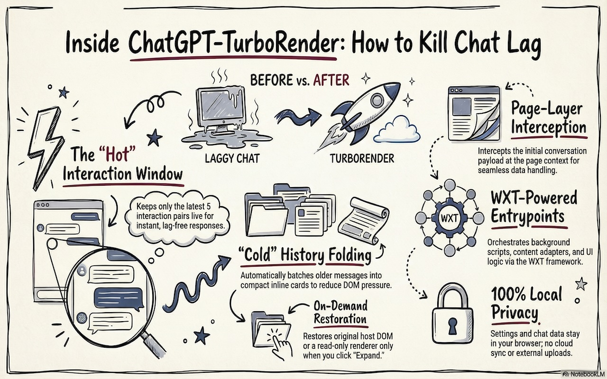

# ChatGPT TurboRender

<p align="center">
  <b>Keep long ChatGPT conversations responsive without replacing the native UI</b>
</p>

<p align="center">
  <a href="https://github.com/mo2g/ChatGPT-TurboRender/stargazers"></a>
  <a href="https://github.com/mo2g/ChatGPT-TurboRender/releases"></a>
  <a href="./LICENSE"></a>
   
  
  
  <a href="./README.zh-CN.md"></a>
</p>

<p align="center">
  <a href="docs/assets/preview.jpg">
    
  </a>
</p>

> 🚀 **TurboRender** brings sliding-window navigation to ChatGPT. Browse, search, and jump through 1000+ turn conversations instantly — without the lag.

**[⬇️ Install from Releases](https://github.com/mo2g/ChatGPT-TurboRender/releases)** • **[📖 Read the Docs](./docs/architecture.md)** • **[🇨🇳 中文文档](./README.zh-CN.md)**

---

## The Problem

Ever had a ChatGPT conversation so long that:
- ⌨️ Typing becomes laggy (input delay > 500ms)
- 📜 Scrolling feels sticky and unresponsive  
- 🐌 The browser starts eating 2GB+ RAM
- ⏱️ Each streamed token makes the whole page stutter

**TurboRender solves this** with **Sliding Window Mode**: render only the current page of messages, cache the full conversation locally, navigate and search instantly.

> 💡 **Love this project?** [Star ⭐ the repo](https://github.com/mo2g/ChatGPT-TurboRender/stargazers) to help others discover it!

## ✨ Key Features

| Feature | Description |
|---------|-------------|
| 🪟 **Sliding Window Mode** | **Primary mode** — browse long conversations like a document. Previous/Next/First/Latest + instant search |
| 🎯 **Native UI Preserved** | Unlike reader-mode extensions, you keep ChatGPT's full functionality |
| 🔍 **Full-Text Search** | Search your entire conversation history instantly, jump to any turn |
| 📦 **Archive Mode** | Auto-folds old messages; keeps latest 5 pairs live. Auto-activates when performance drops |
| 🛡️ **Privacy First** | Zero data leaves your device; local IndexedDB only, no cloud |
| ⚡ **Instant Navigation** | No more waiting for infinite scroll. Jump to any page in milliseconds |

### 🪟 Sliding Window Mode (Recommended)

The **primary mode** for long conversations. TurboRender caches the full conversation payload in browser IndexedDB, while ChatGPT renders only the current window (default 10 pairs).

- **Browse**: Previous / Next / First / Latest buttons
- **Search**: Full-text search across entire conversation
- **Jump**: Go to any page number instantly
- **Read-only history**: Historical windows are read-only; return to Latest before sending new messages

### 📦 Archive Mode

**Archive Mode** (fallback, auto-activated)
- Monitors finalized turn count, live DOM descendants, and frame spikes
- When thresholds are exceeded, folds older messages into compact inline cards while keeping the latest 5 pairs live
- User can expand cards to view full content; sticky `Expand / Collapse` controls on the right
- Falls back to soft-fold mode if host page re-renders aggressively

## 🚀 Quick Start

### Install from GitHub Releases

1. Download the latest release for your browser:
   - **[Chrome/Edge (.zip)](https://github.com/mo2g/ChatGPT-TurboRender/releases)**
   - **[Firefox (.xpi)](https://github.com/mo2g/ChatGPT-TurboRender/releases)**

2. Load as unpacked extension (Chrome/Edge):
   - Open `chrome://extensions` → Enable "Developer mode"
   - Click "Load unpacked" → Select the extracted folder

3. Open any long ChatGPT conversation — TurboRender activates automatically when needed

### Build from Source

```bash
# Clone the repo
git clone https://github.com/mo2g/ChatGPT-TurboRender.git
cd ChatGPT-TurboRender

# Install dependencies and build
pnpm install
pnpm build

# Load .output/chrome-mv3/ as unpacked extension
```

## 📊 Performance Impact

| Metric | Without TurboRender | With TurboRender | Improvement |
|--------|---------------------|------------------|-------------|
| DOM Nodes (1000 turns) | ~50,000+ | ~2,000 | **96% reduction** |
| Input Latency | 300-800ms | <50ms | **Smooth typing** |
| Memory Usage | 2-4GB | 200-400MB | **90% reduction** |
| Scroll Performance | Janky 15-20fps | Smooth 60fps | **Buttery smooth** |

*Actual results vary by conversation length and content. Measured on Chrome 120 with 1000+ turn conversation.*

## 🔒 Privacy & Security

- ✅ **Zero external data** — No conversation content ever leaves your device
- ✅ **No cloud sync** — Everything stays in browser local storage
- ✅ **No analytics** — No tracking, no telemetry
- ✅ **Open source** — Full transparency, MIT licensed
- ✅ **Minimal permissions** — Only runs on `chatgpt.com` and `chat.openai.com`

> Sliding-window mode stores conversation data in **IndexedDB under the ChatGPT origin** (same security boundary as ChatGPT itself). You can clear this cache anytime from the in-page toolbar.

## Toolbar Controls

When Sliding Window Mode is active, the in-page toolbar provides:

- **Navigation**: First, Older, Newer, Latest buttons
- **Page Jump**: Input field to jump to specific page
- **Search**: Full-text search across the entire conversation
- **Cache Management**: Clear current conversation cache or all sliding-window caches
- **Settings**: Configure window size and preferred mode

## Useful Commands

```bash
pnpm dev
pnpm debug:mcp-chrome -- https://chatgpt.com/
pnpm check:mcp-chrome
pnpm reload:mcp-chrome
pnpm test
pnpm test:e2e
pnpm test:e2e -- --chat-url=https://chatgpt.com/c/ceb4ea77-5357-49fb-b35c-607b533846f1
pnpm test:e2e -- --use-active-tab
pnpm test:all
pnpm package:chrome
pnpm package:edge
pnpm package:firefox
```

`pnpm test:e2e:live` remains available as an explicit alias for the same real-page smoke suite. `pnpm test:all` runs `pnpm test:unit` first and then forwards the same live-host arguments to that runner.

## Browser releases

GitHub Actions builds Chrome and Edge `.zip` archives plus a signed Firefox `.xpi` from tagged releases in [.github/workflows/browser-packages.yml](./.github/workflows/browser-packages.yml) and publishes them to GitHub Releases.

See [docs/browser-packages.md](./docs/browser-packages.md) for the tag trigger, release asset names, required signing secrets, and manual install steps.

Store publishing automation is documented separately in [docs/store-publishing.md](./docs/store-publishing.md).

## Controlled Chrome Debugging

This is the primary development and live-validation path for the repo. To debug the unpacked extension with `chrome-devtools` MCP, use the repo-managed browser instead of loading the extension manually inside the MCP browser:

```bash
pnpm build
pnpm debug:mcp-chrome -- https://chatgpt.com/
pnpm check:mcp-chrome
```

`pnpm check:mcp-chrome` now treats the default long `https://chatgpt.com/c/ceb4ea77-5357-49fb-b35c-607b533846f1` session as the exact guardrail target and reports archive readiness, so it is a useful preflight before live smoke.

After each change, use `pnpm build` followed by `pnpm reload:mcp-chrome`, then run one of these real-host regressions:

- `pnpm test:e2e` for the default chat-host smoke on `https://chatgpt.com/c/ceb4ea77-5357-49fb-b35c-607b533846f1`
- `pnpm test:e2e -- --chat-url=https://chatgpt.com/c/ceb4ea77-5357-49fb-b35c-607b533846f1` when you want to override the default chat target explicitly
- `pnpm test:e2e -- --use-active-tab` only as a convenience mode when you are sure the active ChatGPT tab is already the intended long conversation

The launcher starts a dedicated Chromium-based browser on `http://127.0.0.1:9222` with `.output/chrome-mv3` preloaded. It prefers the repo-managed Playwright browser (`Google Chrome for Testing`) or a local Chromium build, because stable Google Chrome no longer honors `--load-extension` for unpacked extensions. After launching it, restart Codex in this repo so the project-level `[.codex/config.toml](./.codex/config.toml)` can point `chrome-devtools` MCP at that browser. For the full guide, see [docs/plan/cdp-connected-development.md](./docs/plan/cdp-connected-development.md).

## Repository Structure

- `pnpm test:e2e` is the mainline signed-in real-page smoke path
- `pnpm test:e2e:live` remains as an explicit alias for that same real-page smoke suite
- popup and other extension-owned UI remain outside host E2E and are covered through unit/integration tests plus manual checks
- Historical background remains in [docs/offline-development.md](./docs/offline-development.md) and [docs/requirements/offline-chatgpt-environment.md](./docs/requirements/offline-chatgpt-environment.md), but those documents are not current test instructions

## Repository map

- `entrypoints/`: WXT entrypoints for background, content script, popup, options, and harness pages
- `lib/content/`: ChatGPT page adapter, parking engine, visibility logic, and in-page status UI
- `lib/background/`: background-side runtime message handling and state orchestration
- `lib/shared/`: settings, types, message contracts, and chat-id helpers
- `lib/testing/`: local transcript fixture used by harness and tests
- `tests/`: unit, integration, and extension-level Playwright coverage
- `docs/`: design rationale and deeper implementation notes

## Design principles

- Solve rendering pressure first
- Preserve the native interaction model
- Keep the extension transparent and reversible
- Prefer local-only state and minimal permissions
- Fail safe when the host DOM changes

## Privacy

TurboRender does not send conversation data to any external service.

- no cloud sync
- no analytics pipeline
- no off-device transcript upload
- performance mode does not persist full transcript snapshots
- sliding-window mode stores complete conversation payloads locally in IndexedDB under the ChatGPT page origin so paging and search can work without redownloading every window
- sliding-window caches can be cleared from the in-page toolbar, either for the current conversation or for all sliding-window conversations
- legacy offline fixture bundles are opt-in local test artifacts only, stored under a gitignored local directory by default

## Roadmap

- More resilient ChatGPT DOM adapters
- Better per-chat diagnostics in the popup
- Firefox support with a background-runtime swap
- Store-ready assets, screenshots, and publishing metadata
- Larger real-world performance benchmark corpus

## Contributing

Issues and PRs are welcome, especially if you can provide:

- a reproducible long-thread slowdown case
- a DOM snapshot or screen recording after a ChatGPT UI change
- a performance profile comparing extension on vs. off

<a id="support"></a>

<a id="popup-status-control-panel"></a>

## Popup Status/Control Panel

The popup is a status/control panel for supported ChatGPT conversation pages only.

- Supported routes: `https://chatgpt.com/c/<id>`, `https://chatgpt.com/share/<id>`, `https://chat.openai.com/c/<id>`, `https://chat.openai.com/share/<id>`
- Unsupported ChatGPT pages show an explicit unsupported state and a link to the supported URL rules
- When the active tab is a supported ChatGPT conversation page but its runtime is temporarily unavailable, the popup can show a recovery state for that page
- The demo button opens a stable share page: [https://chatgpt.com/share/69cb7947-c818-83e8-9851-1361e4480e08](https://chatgpt.com/share/69cb7947-c818-83e8-9851-1361e4480e08)
- The help button opens this section

## Support

If TurboRender saves you time, you can support ongoing maintenance and compatibility updates.

| WeChat sponsor code | Alipay sponsor code |
| --- | --- |
|  |  |

Support helps cover maintenance, long-thread testing, and ChatGPT compatibility updates.

## License

[MIT](./LICENSE)
