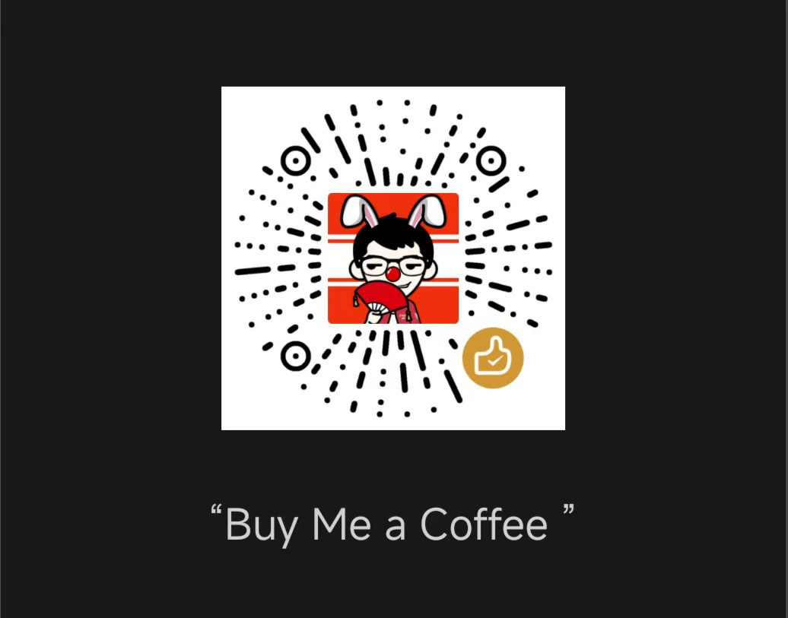

# ChatGPT TurboRender

尽量不改 ChatGPT 原生界面，只解决“超长对话把网页拖慢”这件事。

[English README](./README.md) | [架构说明](./docs/architecture.zh-CN.md) | [Architecture Notes](./docs/architecture.md) | [受控 Chrome Cookbook](./docs/cookbook-controlled-chrome.zh-CN.md) | [Controlled Chrome Cookbook](./docs/cookbook-controlled-chrome.md)

ChatGPT TurboRender 是一个 Chromium 优先的浏览器扩展，目标是在超长 ChatGPT 会话中降低掉帧、输入延迟、滚动卡顿和页面无响应问题。它通过“首屏裁剪冷历史 + 热区保留 + 按需恢复”的方式，减少页面上长期活跃的 DOM 负担。

如果这个项目对你有帮助，欢迎 Star 仓库，也欢迎带着性能录屏、Profile 或复现案例来提 Issue。真实世界的长对话样本，是把插件做稳的最快方式。

如果它也帮你节省了时间，可以看下方的 [支持项目](#support)。

## 为什么要做这个项目

ChatGPT 对话一旦很长，网页端通常会出现这些问题：

- 历史消息越来越多，DOM 节点不断堆积
- 回答流式生成时，每次更新都要碰一个很大的节点树
- 滚动开始卡顿
- 输入框延迟明显
- CPU、内存持续上升

TurboRender 的目标不是改造你的使用习惯，而是把渲染压力从主线程上挪开。它保留最近的热区消息，把更早、已完成的历史消息裁剪或折叠成轻量历史块，只有在你真的回看时才恢复。

## 它现在能做什么

- 尽量保留 ChatGPT 原生界面，而不是强制切到自定义阅读器模式
- 默认只保留最近 5 对交互，其余历史按原位批次卡片折叠在 transcript 里
- 当线程长度或帧压力超过阈值时自动介入
- 在页面主世界里裁剪首屏 ` /backend-api/conversation/:id ` payload，并支持 share 页 loaderData
- 将冷区消息按组 parking，并替换成轻量原位批次卡片
- 长批次展开后，右侧 `展开 / 折叠` 按钮会随滚动保持可见
- 支持英文与简体中文，默认自动跟随，也可手动覆盖
- 如果宿主页 DOM 变化太激进，会自动切到更保守的 soft-fold 模式
- 所有设置只保存在本地，不会把对话内容发送到外部服务

## 项目状态

- 首发浏览器：Chrome / Edge
- 运行模型：Manifest V3
- 数据边界：仅本地
- 网络边界：仅在页面层拦截并裁剪首屏 conversation payload，不接后端、不做云同步
- 当前 E2E 说明：仓库里已经有 Playwright 扩展测试，但在某些无头沙箱里拉起 Chromium persistent extension context 仍然可能不稳定

## 折叠历史如何工作

TurboRender 会保留最新 5 对交互继续走原生 ChatGPT transcript。

- 更早历史保持在原本的位置，只是折叠成批次卡片
- 每个批次默认容纳 5 对交互，顺序不变
- 已经进入官方 DOM 的批次，展开时优先恢复原始宿主 DOM
- 首屏被裁掉的批次，展开时会在原位显示近似原生的只读内容
- 如果展开后的批次很长，右侧的 `展开 / 折叠` 操作轨会随滚动保持可见，方便快速收回

## 快速开始

```bash
pnpm install
pnpm build
```

然后在 Chrome 或 Edge 中以开发者模式加载 `.output/chrome-mv3`。

常用命令：

```bash
pnpm dev
pnpm test
pnpm test:all
pnpm zip
```

## 受控 Chrome 调试

如果要让 `chrome-devtools` MCP 调试真正连到“已加载 unpacked 扩展”的浏览器，不要再在 MCP 自启浏览器里手动点 `chrome://extensions`。统一使用仓库内的受控 Chrome 启动命令：

```bash
pnpm debug:mcp-chrome -- https://chatgpt.com/share/69c62773-7b4c-83e8-b441-48520275c284
```

这个命令会拉起一个固定监听 `http://127.0.0.1:9222` 的 Chromium 系浏览器，并预加载 `.output/chrome-mv3`。启动器会优先使用仓库自带的 Playwright 浏览器（`Google Chrome for Testing`）或本地 Chromium，因为稳定版 Google Chrome 已经不再对 unpacked 扩展生效 `--load-extension`。启动后重新打开当前仓库的 Codex 会话，让项目级的 `[.codex/config.toml](./.codex/config.toml)` 把 `chrome-devtools` MCP 指向这个浏览器。

## 仓库结构

- `entrypoints/`：WXT 入口，包括 background、content script、popup、options 和本地 harness 页面
- `lib/content/`：ChatGPT 页面适配、停车引擎、可见区计算、页内状态条
- `lib/background/`：后台消息处理和状态编排
- `lib/shared/`：设置、类型、消息协议、chat-id 工具
- `lib/testing/`：harness 和测试共用的 transcript fixture
- `tests/`：单元测试、集成测试、扩展级 Playwright 测试
- `docs/`：设计思路与实现说明

## 设计原则

- 先解决渲染压力
- 尽量保留原生交互
- 让扩展透明、可逆、可暂停
- 本地优先、权限最小化
- 宿主页变化时优先安全降级

## 隐私边界

TurboRender 不会把对话内容发送到任何外部服务。

- 没有云同步
- 没有埋点分析
- 不会把完整对话上传到设备外
- v1 不持久化完整对话快照

## Roadmap

- 更稳的 ChatGPT DOM 适配器
- Popup 中更细的单会话诊断信息
- 通过替换后台运行时继续推进 Firefox 支持
- 补齐商店发布所需截图、素材和元数据
- 建立更大的真实长对话性能样本库

## 参与贡献

欢迎提 Issue 或 PR，尤其是下面几类信息很有价值：

- 可稳定复现的长对话卡顿案例
- ChatGPT 页面结构变化后的 DOM 快照或录屏
- 插件开关前后的性能对比 Profile

<a id="support"></a>

## 支持项目

如果 TurboRender 帮你节省了时间，也欢迎支持后续维护和兼容性更新。

| 微信赞赏码 | 支付宝收款码 |
| --- | --- |
|  |  |

支持会帮助我持续做维护、真实长对话测试，以及 ChatGPT 兼容性更新。

## License

[MIT](./LICENSE)
