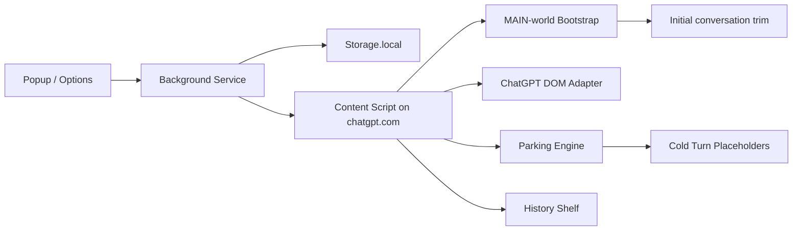

# ChatGPT TurboRender Architecture Notes

This document explains how TurboRender approaches long-thread ChatGPT slowdown and why the extension is intentionally conservative about what it touches.

[中文版本](./architecture.zh-CN.md)

## The problem model

Long ChatGPT threads become expensive for the browser for a simple reason: too much UI remains live at once.

- every finalized turn still participates in layout, style, and tree traversal
- streamed output keeps invalidating and touching a large subtree
- scrolling and typing compete with rendering on the same main thread
- once enough history accumulates, the browser can drift into a slow or unresponsive state

TurboRender treats this primarily as a rendering-pressure problem, not a prompt-management problem.

## Goals

- Preserve the native ChatGPT interface
- Improve responsiveness in very long sessions
- Keep the latest turns fully interactive
- Make old history reversible and restorable
- Stay local-only and low-permission
- Fail safe if ChatGPT changes its DOM

## Non-goals for v1

- A custom full-screen reader mode
- Cross-device sync
- Export and search tooling
- Background-level network middleware or backend proxying
- Persisting complete transcript snapshots

## Runtime architecture

## Main subsystems

## 1. DOM adapter

The adapter identifies:

- the ChatGPT transcript area
- the top-level turn nodes
- the scroll container
- the current chat id
- basic streaming heuristics

It is deliberately layered and conservative. If the page structure does not fit the expected shape, the extension marks the page unsupported instead of forcing a brittle transform.

## 2. Initial trim + activation heuristics

TurboRender now has two layers of intervention.

- First, a `document_start` main-world bootstrap watches the initial `conversation/:id` payload. If the session is already very long, it trims the active branch down to a hot window before the official ChatGPT renderer mounts the full history.
- Second, the content script still watches for:

- finalized turn count
- live descendant count
- frame-spike pressure

Once the thresholds trip, the extension latches into active mode for that session unless the user pauses it.

## 3. Hot window retention

The engine keeps a hot window:

- the most recent turns
- the turns around the current viewport

This reduces the chance of parking content that the user is about to interact with.

## 4. DOM parking

Older finalized turn groups are moved out of the live transcript and replaced with lightweight placeholders.

Each placeholder can restore:

- the local parked group
- nearby history via the status bar
- all parked history via the status bar or popup

The parking operation is grouped so the extension is not constantly moving single nodes around.

## 5. Safe fallback

Hard parking is stronger but riskier on a React-heavy host page.

If TurboRender detects that:

- the placeholder anchor disappears
- the host page re-renders unexpectedly
- restore integrity becomes questionable

it flips the session to soft-fold mode. Soft-fold keeps the nodes in the DOM and only applies a reversible collapse style.

## Why intercept the initial payload at all?

Because DOM-only parking still pays the cost of the first huge render.

- Trimming the initial conversation payload reduces the official first render cost
- Doing it in the page main world avoids MV3 backend body-rewrite limits
- The extension still stays local-only and does not proxy requests through any remote service
- Ongoing history management still happens at the DOM layer for safer rollback

So TurboRender touches only the initial page-side conversation payload, not the broader transport stack.

## Why not just hide old nodes with CSS?

Pure CSS hiding is safer, but it does not remove enough pressure in the common long-thread case.

That is why the design uses a two-level model:

- hard parking when the page structure looks stable
- soft-fold when the host page becomes unpredictable

## Testing strategy

- Unit tests cover activation thresholds, hot-window calculation, and background message handling
- Integration tests use a local transcript fixture to verify parking and restore behavior without relying on a real ChatGPT account
- Playwright coverage targets the built extension harness, but extension launch remains environment-sensitive in some headless sandboxes

## Future directions

- Collect more real-world DOM variants from ChatGPT updates
- Improve heuristics for streaming detection and protected regions
- Add Firefox support behind a runtime adapter boundary
- Publish store-ready assets and profiling data
