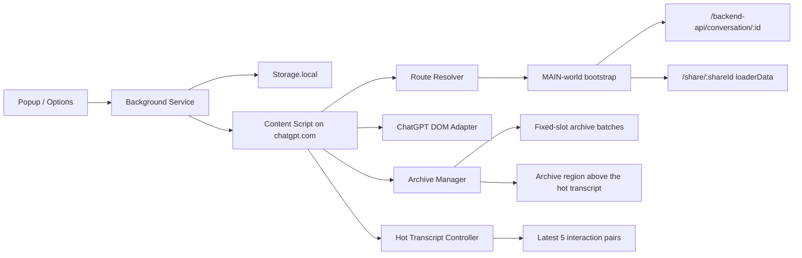

# ChatGPT TurboRender Architecture Notes

This document describes the current implementation of TurboRender: a hot transcript that stays inside ChatGPT's native flow, and an extension-controlled archive region that keeps older history out of the live subtree.

[中文版本](./architecture.zh-CN.md)

## Problem model

Long ChatGPT conversations stay expensive for one simple reason: too much UI remains live at once.

- finalized turns continue to participate in layout, style, and tree traversal
- streamed output keeps invalidating a large subtree
- scrolling and typing compete with rendering on the same main thread
- once enough history accumulates, the browser can become slow or unresponsive

TurboRender treats this primarily as a rendering-pressure problem, not a prompt-management problem.

## Goals

- Preserve the native ChatGPT reading and interaction flow
- Keep the latest interaction pairs fully interactive
- Move older history out of the live transcript subtree
- Keep archive history reversible and searchable at the batch level
- Stay local-only and low-permission
- Fail safe when ChatGPT's DOM or loader data changes

## Non-goals for vNext

- A custom full-screen reader mode
- Cross-device sync
- Export tooling or deep search over the entire conversation corpus
- Backend-level network middleware or remote proxying
- Persisting complete transcript snapshots
- Preserving host-native edit/regenerate menus inside archived history

## Runtime architecture

## Execution flow

1. The content script resolves the page route into a runtime id:
   - `/c/:id` becomes `chat:<id>`
   - `/share/:id` becomes `share:<id>`
   - `/` becomes `chat:home`
   - unknown routes are tagged `chat:unknown`
2. The main-world bootstrap captures the initial payload before the full DOM pressure lands:
   - chat pages read `/backend-api/conversation/:id`
   - share pages read React Router loader data from `routes/share.$shareId.($action)`
3. The content script keeps the live transcript hot window small and moves older history into the archive region.
4. The archive region is rendered by TurboRender, not by the host React tree.
5. Search, collapse, restore, and sticky controls are handled inside the archive region.

## Main subsystems

## 1. Route identity and DOM adapter

The adapter identifies:

- the ChatGPT transcript area
- the top-level turn nodes
- the scroll container
- the current route kind
- basic streaming heuristics

The adapter is deliberately layered and conservative. If the page structure does not fit the expected shape, the extension marks the page unsupported instead of forcing a brittle transform.

## 2. MAIN-world bootstrap

TurboRender now captures the initial session in the page main world before the official renderer fully expands the history.

- chat pages trim the initial `conversation/:id` payload down to a hot branch
- share pages extract the same payload shape from React Router loader data
- share pages do not rely on a separate network middleware path
- if the payload shape changes, the system falls back to live-DOM-only history management

This keeps the first render smaller without depending on MV3 backend body rewriting.

## 3. Hot transcript plus archive region

TurboRender now uses a two-zone model.

- the official transcript keeps only the latest 5 interaction pairs
- older history is moved into an extension-controlled archive region above the hot transcript
- the archive region shares the page's main scroll container
- archive history does not get reinserted into the host transcript when expanded

This separation is the main lever for reducing input latency and scroll jank.

## 4. Fixed-slot batching

Archive history is grouped into fixed 5-pair slots.

- slot ranges are stable, such as `96-100` or `101-105`
- partially filled slots still show their full range plus a fill count
- new history continues filling the current slot until it reaches capacity
- initial-trim history and runtime-demoted history are merged into one archive timeline before slotting

This avoids tail rebalancing like `96-98 / 99-101` and keeps the UI stable across updates.

## 5. Archive rendering

The archive region uses a read-only, near-native transcript style instead of a nested card stack.

- collapsed batches show only the slot summary, preview text, match count, and a sticky `Expand / Collapse` rail
- expanded batches render user messages as right-aligned bubbles
- assistant messages stay in a centered reading flow
- markdown blocks, lists, quotes, and code blocks are rendered directly
- structured tool/system messages stay inside the interaction pair instead of surfacing as separate top-level messages
- visually hidden payload messages are suppressed entirely

The goal is to keep reading behavior close to ChatGPT's native flow while still removing cold history from the live subtree.

## 6. Parking engine

Older finalized live turns can be demoted out of the hot transcript.

- hard parking removes the nodes from the live transcript and stores them for later restoration
- soft-fold keeps the nodes in the DOM but collapses them when the host page is too unstable for hard parking
- live transcript mutations are observed only in the hot zone, not in the archive region or composer subtree

The parking engine exists to keep the live transcript small. The archive region is the user-visible way to inspect cold history.

## 7. Restore and scroll behavior

Archive controls are batch-level, not message-level.

- `Expand / Collapse` operates on a whole 5-pair slot
- the sticky rail belongs to the archive batch itself
- toggling a batch preserves scroll position instead of jumping to the top
- the archive region can be expanded batch by batch without affecting other batches

The restore model is intentionally coarse. It is designed to avoid turning the archive UI back into a heavy live subtree.

## 8. Search and diagnostics

TurboRender keeps search local to the archive region.

- searches are evaluated against archive batches
- hidden system scaffolds do not participate in search
- popup diagnostics report route kind, batch counts, observed root kind, and refresh counts
- the content script keeps the current build signature available for debugging

## Controlled Chrome validation

Development and manual validation use a repo-managed controlled Chrome instance instead of manually loading the unpacked extension inside the DevTools MCP browser.

- launch with `pnpm debug:mcp-chrome -- https://chatgpt.com/c/<chat-id>` or `pnpm debug:mcp-chrome -- https://chatgpt.com/share/<share-id>`
- the launcher prefers `Google Chrome for Testing` or a compatible Chromium binary
- the unpacked extension is preloaded from `.output/chrome-mv3`
- the browser runs with a dedicated profile and remote debugging port so the MCP session can reconnect reliably

This is important because stable Google Chrome no longer behaves reliably for unpacked extension loading through `--load-extension`.

## Why this architecture works

TurboRender limits the live subtree while preserving ChatGPT's reading flow.

- the hot transcript stays small enough to keep typing and streaming responsive
- the archive region keeps cold history available without remaining part of the live host subtree
- the first render is cheaper because long sessions are trimmed before the official renderer mounts the full history
- the system remains local-only and can safely fall back when the host page changes

## Testing strategy

- Unit tests cover route identity, payload trimming, fixed-slot batching, and background message handling
- Integration tests use local transcript fixtures to verify archive rendering, restore behavior, and soft-fold fallback
- Controlled Chrome is used for manual verification on real ChatGPT pages, especially `/c/...` and `/share/...`

## Future directions

- Collect more real-world DOM variants from ChatGPT updates
- Improve heuristics for streaming detection and protected regions
- Tighten the hot-zone observer further if real `/c/...` typing traces still show pressure
- Continue validating against share pages and long live chats before expanding the restore model
