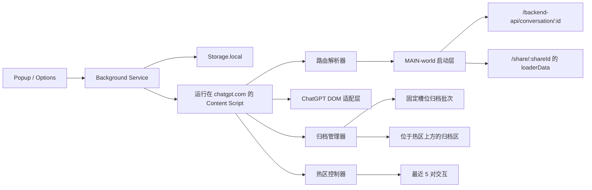

# ChatGPT TurboRender 架构说明

这份文档描述的是 TurboRender 当前的落地架构：默认 performance 模式把 ChatGPT 的最新对话保留在原生热区里，把更早历史移到扩展自管的归档区；可选 sliding-window 模式则让官方 UI 一次只渲染一个数据窗口。

[English version](./architecture.md) | [重构设计与避坑指南](./refactor-design-and-pitfalls.zh-CN.md) | [归档 Action 复用边界](./action-reuse-map.zh-CN.md)

## 问题模型

超长 ChatGPT 对话之所以会拖慢浏览器，原因很直接：页面上同时保持活跃的 UI 太多了。

- 已完成的历史消息仍然持续参与布局、样式计算和节点遍历
- 流式生成中的回复会不断触碰一个越来越大的节点树
- 滚动、输入和渲染都在争抢同一条主线程
- 历史一旦足够长，浏览器就容易进入慢、卡、甚至无响应的状态

TurboRender 把这件事首先看成“渲染压力问题”，而不是“提示词管理问题”。

## 目标

- 保留 ChatGPT 原生的阅读和交互习惯
- 让最新的交互对保持完整可交互
- 把更早历史移出 live subtree
- 让归档历史以批次级别保持可恢复、可搜索
- 提供可选的数据窗口模式，不渲染归档卡片也能翻看超长会话
- 本地优先、权限最小化
- 当 ChatGPT 的 DOM 或 loader data 发生变化时优先安全降级

## vNext 非目标

- 自定义全屏阅读器模式
- 跨设备同步
- 导出工具或对整段对话做深度全文检索
- 后台中间件式网络代理或远端转发
- 在 performance 模式里持久化完整对话快照
- 在归档历史里继续保留宿主原生的编辑/重新生成菜单

## 运行时架构

## 执行流程

1. 内容脚本先把当前页面解析成统一的运行时 id：
   - `/c/:id` 变成 `chat:<id>`
   - `/share/:id` 变成 `share:<id>`
   - `/` 变成 `chat:home`
   - 其他路径标记为 `chat:unknown`
2. MAIN-world 启动层在官方渲染把完整历史压上来之前先抓首屏 session：
   - chat 页面读取 `/backend-api/conversation/:id`
   - share 页面从 React Router 的 loader data 里提取同样的数据形状
3. content script 把 live transcript 的热区保持得很小，并把更早历史移到归档区。
4. 归档区由 TurboRender 自己渲染，不再挂在宿主 React 子树里继续膨胀。
5. 搜索、折叠、恢复和 sticky 控件都在归档区内部完成。

在 sliding-window 模式中，MAIN-world 启动层会改为本地缓存完整 conversation payload，返回裁剪后的 synthetic conversation response，并继续让 ChatGPT 官方渲染器负责当前窗口。

## 主要子系统

## 1. 路由身份与 DOM 适配层

适配层负责识别：

- ChatGPT transcript 区域
- 顶层 turn 节点
- 滚动容器
- 当前路由类型
- 基础流式生成状态

它采用分层且保守的策略。如果页面结构不符合预期，扩展会把当前页面标记为 unsupported，而不是强行做脆弱的 DOM 改写。

## 2. MAIN-world 启动层

TurboRender 会在页面 main world 里先抓初始 session，再交给后续渲染逻辑。

- chat 页面会把首屏 `conversation/:id` 裁剪到热区窗口
- share 页面会从 `routes/share.$shareId.($action)` 的 loader data 中提取同样的 payload
- share 页面不依赖单独的网络中间层
- sliding-window 模式可以在调用原生 fetch 前，直接用干净缓存返回 synthetic conversation response
- 如果 payload 结构变化，系统会回退到仅基于 live DOM 的历史管理

这样可以降低首屏渲染压力，又不依赖 MV3 后台改 body。

## 3. 热区 + 归档区

TurboRender 现在采用两段式模型。

- 官方 transcript 只保留最近 5 对交互
- 更早历史统一移到扩展自管的归档区，并放在热区上方
- 归档区与页面主滚动容器共用同一滚动链路
- 归档历史展开后不会再灌回宿主 transcript

这是降低输入卡顿和滚动抖动的主要手段。

## 4. 可选 sliding-window 模式

Sliding-window 是数据窗口模式，不是历史消息 UI 模式。

- ChatGPT 官方 UI 渲染当前 N 对交互的 synthetic payload
- TurboRender 在 ChatGPT 页面 origin 下的本地 IndexedDB 缓存完整 conversation payload、pair index 和 search index
- 上一页、下一页、最新和搜索会把目标 range 写入 sessionStorage，然后 reload 当前路由
- 干净缓存命中时，翻页不会默认重新下载完整 conversation payload
- 非最新窗口在 content 层按只读处理
- 工具条可以清除当前会话缓存，也可以清除全部 sliding-window 缓存

这个模式刻意不使用归档卡片，也不使用 parking renderer 渲染历史正文。

## 5. 固定槽位分批

归档历史按固定的 5 对交互槽位切分。

- 槽位范围是稳定的，例如 `96-100`、`101-105`
- 槽位未填满时，也会显示完整范围和当前填充数
- 新归档历史会继续填充当前槽位，直到该槽位满员
- 首屏裁剪的历史和运行时 demote 的历史会先合并成同一条归档时间线，再按槽位分批

这样可以避免 `96-98 / 99-101` 这类动态重排，也让 UI 在后续更新里保持稳定。

## 6. 归档区渲染

归档区采用只读的、尽量接近原生 transcript 的展示方式，而不是一层层卡片堆叠。

- 折叠态只显示槽位摘要、预览文本、命中数和 sticky 的 `展开 / 折叠` 操作轨
- 展开后用户消息按右侧气泡渲染
- 助手消息保持居中的正文流
- markdown、列表、引用和代码块直接渲染
- tool/system 结构化消息保留在同一对交互内部，不再冒成顶层消息
- `metadata.is_visually_hidden_from_conversation === true` 的内容直接不渲染

目标是在尽量贴近 ChatGPT 原生阅读习惯的同时，把冷历史从 live subtree 里拿出去。

## 7. 停车引擎

更早的已完成 live turn 可以从热区里降级出去。

- hard parking 会把节点从 live transcript 中移走，并保留起来方便恢复
- soft-fold 在宿主页不稳定时保留节点，只做可逆折叠
- live transcript 的 mutation 只观察热区，不观察归档区，也不观察 composer 子树

停车引擎的职责是保持 live subtree 足够小。归档区才是用户查看冷历史的界面。

## 8. 恢复与滚动行为

归档控制是批次级的，不是逐条消息级的。

- `展开 / 折叠` 操作作用于一个完整的 5 对交互槽位
- sticky 操作轨只属于归档批次本身
- 展开或折叠时会保持滚动位置，不再跳到页面顶部
- 每个批次可以独立展开或折叠，不影响其他批次

恢复模型刻意保持粗粒度。这样可以避免归档 UI 又退化成一个新的重型 live subtree。

## 9. 搜索与诊断

TurboRender 只在归档区内部做本地搜索。

- 搜索只对归档批次求值
- 被隐藏的系统 scaffolding 不参与搜索
- popup 诊断会显示 route kind、批次数量、观测根类型和 refresh 计数
- content script 会保留当前 build signature，方便排障

## 存储与隐私边界

TurboRender 不会把对话内容发送到任何外部服务。

- 设置保存在扩展存储中
- performance 模式不会持久化完整对话快照
- sliding-window 模式会把完整 conversation payload 保存在 ChatGPT 页面 origin 下的本地 IndexedDB
- sliding-window 缓存用于翻页和搜索，可在页内工具条中清除
- 没有云同步、埋点分析或设备外 transcript 上传

## 受控 Chrome 验证

开发和手工验证都通过仓库提供的受控 Chrome 实例进行，而不是在 DevTools MCP 浏览器里手工加载 unpacked 扩展。

- 使用 `pnpm debug:mcp-chrome -- https://chatgpt.com/c/<chat-id>`
- 启动器优先选择 `Google Chrome for Testing` 或兼容的 Chromium 二进制
- unpacked 扩展会从 `.output/chrome-mv3` 预加载
- 浏览器使用独立 profile 和 remote debugging 端口，MCP 会话才能稳定重新连接

这一步很重要，因为稳定版 Google Chrome 现在不再可靠地支持通过 `--load-extension` 加载 unpacked 扩展。

## 为什么这套架构有效

TurboRender 通过限制 live subtree 大小，同时保留 ChatGPT 原生的阅读流来工作。

- 热区足够小，打字和流式生成更容易保持响应
- 归档区保留冷历史，但不继续参与宿主 live subtree 的压力
- 首屏更轻，因为超长会话会在官方渲染前先被裁剪
- 系统保持本地执行，并且在宿主页变化时可以安全降级

## 测试策略

- 单元测试覆盖路由身份、payload 裁剪、固定槽位分批和后台消息处理
- sliding-window 单元测试覆盖窗口 range、pair index、payload slicing、cache hit/miss/dirty、content 模式分发、工具条桥接消息和只读控制
- 受控 Chrome + `pnpm test:e2e` 在默认登录态长会话 `https://chatgpt.com/c/ceb4ea77-5357-49fb-b35c-607b533846f1` 上是当前主宿主兼容性验证路径；`--use-active-tab` 只是显式便捷模式，`pnpm test:e2e:live` 继续保留为同一套 live runner 的别名
- 集成测试和历史本地 fixture 脚本继续保留，用于归档渲染、恢复行为和 soft-fold 降级等定向补充覆盖，但不再作为宿主真相来源

## 后续方向

- 收集更多 ChatGPT DOM 变体
- 继续改进流式生成识别和保护区判断
- 如果真实 `/c/...` 的打字 trace 仍然有压力，再进一步收紧热区观察范围
- 在扩大恢复模型之前，继续用长会话做回归验证
