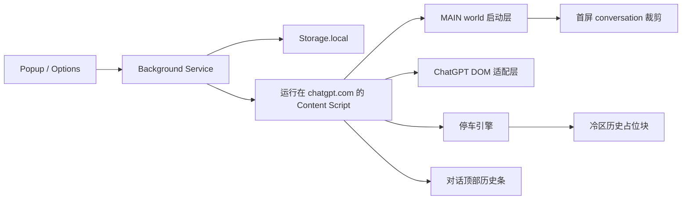

# ChatGPT TurboRender 架构说明

这份文档解释 TurboRender 是如何处理 ChatGPT 超长对话卡顿问题的，以及为什么这个扩展在实现上会刻意保持保守。

[English version](./architecture.md)

## 问题模型

超长 ChatGPT 对话会拖慢浏览器，核心原因其实很直接：页面上长期活跃的 UI 太多了。

- 已完成的历史消息仍然持续参与布局、样式计算和节点遍历
- 流式生成中的回复会不断触碰一个越来越大的节点树
- 滚动、输入和渲染都在争抢同一条主线程
- 历史一旦足够长，浏览器就容易进入慢、卡、甚至无响应的状态

TurboRender 把这件事首先看成“渲染压力问题”，而不是“提示词管理问题”。

## 目标

- 保留 ChatGPT 原生界面
- 提升超长会话下的响应性
- 保证最近消息仍然是完整可交互的
- 让旧历史可恢复、可回看
- 本地优先、权限最小化
- 当 ChatGPT DOM 发生变化时优先安全降级

## v1 非目标

- 自定义全屏阅读器模式
- 跨设备同步
- 导出/搜索工具
- 后台中间件式网络代理或服务端转发
- 完整对话快照持久化

## 运行时架构

## 主要子系统

## 1. DOM 适配层

适配层负责识别：

- ChatGPT transcript 区域
- 顶层 turn 节点
- 滚动容器
- 当前 chat id
- 基础流式生成状态

它采用分层且保守的策略。如果页面结构不符合预期，扩展会把当前页面标记为 unsupported，而不是强行做脆弱的 DOM 改写。

## 2. 首屏裁剪 + 激活策略

TurboRender 现在有两层介入路径。

- 第一层是在 `document_start` 的 main world 启动脚本里观察首屏 `conversation/:id` payload。如果会话已经很长，就先沿活跃分支裁剪到热区窗口，再交给官方前端首屏渲染。
- 第二层仍然由 content script 继续监控：

- 已完成消息数量
- 当前活跃后代节点数量
- 帧抖动压力

当任一阈值越线后，该会话会进入 active 状态，除非用户手动暂停。

## 3. 热区保留

引擎会保留一块热区：

- 最新若干轮消息
- 当前视口附近的若干轮消息

这样可以尽量避免把用户马上要操作的内容停车掉。

## 4. DOM parking

更早、已完成的消息会被按组从 live transcript 中移走，并换成轻量占位块。

每个占位块都支持恢复：

- 当前分组
- 通过状态条恢复附近历史
- 通过状态条或 popup 恢复全部历史

分组处理的目的，是避免扩展不停地搬运单条节点，造成新的抖动。

## 5. 安全降级

Hard parking 的收益更大，但在 React 宿主页上风险也更高。

如果 TurboRender 检测到：

- 占位锚点丢失
- 宿主页发生不可预期的重渲染
- 恢复完整性出现疑问

它会把当前会话切到 soft-fold 模式。soft-fold 不再移除节点，只做可逆的折叠样式。

## 为什么要碰首屏 payload？

因为只做 DOM parking，仍然要先承受一次完整的超长首屏渲染成本。

- 裁剪首屏 conversation payload 可以直接降低官方首屏渲染压力
- 在页面 main world 做这件事，比 MV3 后台改 body 更可控
- 扩展依然是本地执行，不会通过远端服务代理请求
- 后续历史管理仍然主要在 DOM 层完成，便于安全回滚

所以 TurboRender 只碰页面内的首屏 conversation 数据，不扩展到更大范围的传输栈。

## 为什么不直接用 CSS 隐藏旧节点？

纯 CSS 隐藏更安全，但在超长会话场景下，通常不足以真正释放足够多的压力。

所以这里采用两级模型：

- 页面结构稳定时，用 hard parking
- 宿主页不稳定时，退回 soft-fold

## 测试策略

- 单元测试覆盖阈值判断、热区计算和后台消息协议
- 集成测试用本地 transcript fixture 验证 parking/restore 行为，不依赖真实 ChatGPT 账号
- Playwright 负责扩展构建产物的 harness 场景，但在部分无头沙箱中，扩展上下文启动仍然可能受环境影响

## 后续方向

- 收集更多 ChatGPT DOM 变体
- 改进流式生成识别和保护区判断
- 通过运行时适配边界继续推进 Firefox 支持
- 补齐商店发布素材与性能数据
